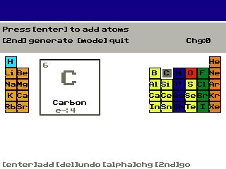

# Lewis Structure Generator (TI-84 Plus CE)

This repository publishes the `lewis-dot` CEdev project for TI-84 Plus CE calculators.

`lewis-dot` is an interactive Lewis dot structure generator with support for molecular charge and resonance forms.

## Screenshot



## Requirements

- [CEdev](https://ce-programming.github.io/toolchain/) installed
- `CEDEV` environment variable set to your CEdev install path
- `make` available in your shell

The project `Makefile` includes:

```make
ifndef CEDEV
$(error CEDEV environment variable is not set.)
endif
```

## Build

Build from the `lewis-dot` directory:

```powershell
cd lewis-dot
make
```

Compiled calculator files are written to `lewis-dot/bin/`.

To clean generated files:

```powershell
make clean
```

## Controls

### `lewis-dot`

- Arrow keys: move periodic-table cursor
- `Enter`: add highlighted element
- `Del`: remove last atom
- `Alpha`: cycle charge (`0`, `+1`, `+2`, `-1`, `-2`)
- `2nd`: generate Lewis structure
- Left/Right: cycle resonance structures
- `Clear`: return to periodic table view
- `Mode`: quit

## Project Layout

- `lewis-dot/` - Lewis structure generator source + CEdev build files
